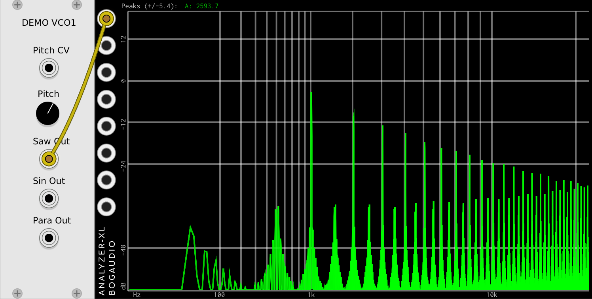

# How does Demo VCO1 look on the analyzer

First, a little DSP. A digital signal at a sample rate of Fs can not represent/contain any frequencies/harmonics above Fs/2. This frequency, half the sample rate, is called the "Nyquist" frequency. If you are interestd in this stuff there are many sources, starting with Wikipedia.

Now,here is our demo putting out a sawtooth wave near 1kHz.

OK, that looks a lot different than what we saw from Fundamental VCO-1. If you remember from the last page, a nice clean digital sawtooth (like the one from Fundamental VCO-1) has all the normal sawtooth harmonics, going all the way to half the sample rate (22050 in our examples). The the higher harmonics just disappear.

What we see here with Demo VCO1 is that the harmonics to up to Fs/2 (22050), but instead of going away, the higher harmonics reflect back down into the audible frequency range. You can clearly see that between every "good" harmonic there is some "bad" aliasing too.

Observe that at very high frequencies there is as much alias is there is harmonic.

Now, there are cases where some people might like the sound of aliasing. But in general it's considered to be awful sounding, and most digital audio products go to great lengths to avoid it. Even if you want a "lo fi" sound, you probably don't want this sound.

At this point, if you don't already have an opinion on aliasing, you might want to go read the internet and see what people have to say about aliasing. There are even some (contrived?) audio examples you can listen on.

If you look carefully at the illustration, above, there is something else odd there. Notice that at each frequency, instead of a nice vertical line it looks more like a tapered cone. The frequencies seem to spread out at the base of each tone. What is this?

That is actually phase jitter. The causes and cures of this kind phase jitter are very similar to the causes and cures for aliasing, so we won't talk about it too much. But we will come back to it later.

Always keep in mind - in the analog world we are used to some amount of noise, but unless very extreme it's not very objectionable. Analog noise is usually "uncorrelated" with the desired signal, which makes it much easier to ignore, and much easier for your brain to filter out.

Aliasing and phase quantization jitter, however, are correlated with the signal, and sound very, very different from analog noise. One extreme example - if you apply pitch bend to an aliasing VCO to raise the pitch, you can easily hear the undesirable alias tones bending down in the other direction!

With analog noise we are used to seeing it on an analyzer and saying "oh, it's 24 DB down, probably doesn't matter". But digital noise and distortion is a totally different matter. 24 DB down may be quite audible.

The next section has [more on VCO1 aliasing](./aliasing2.md)