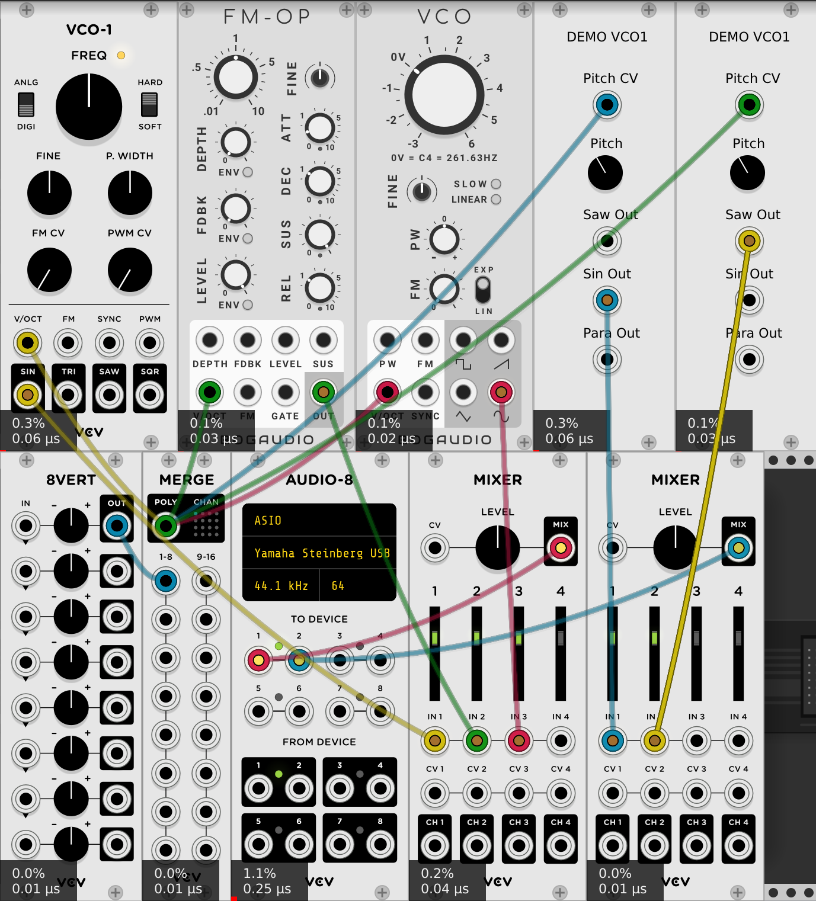
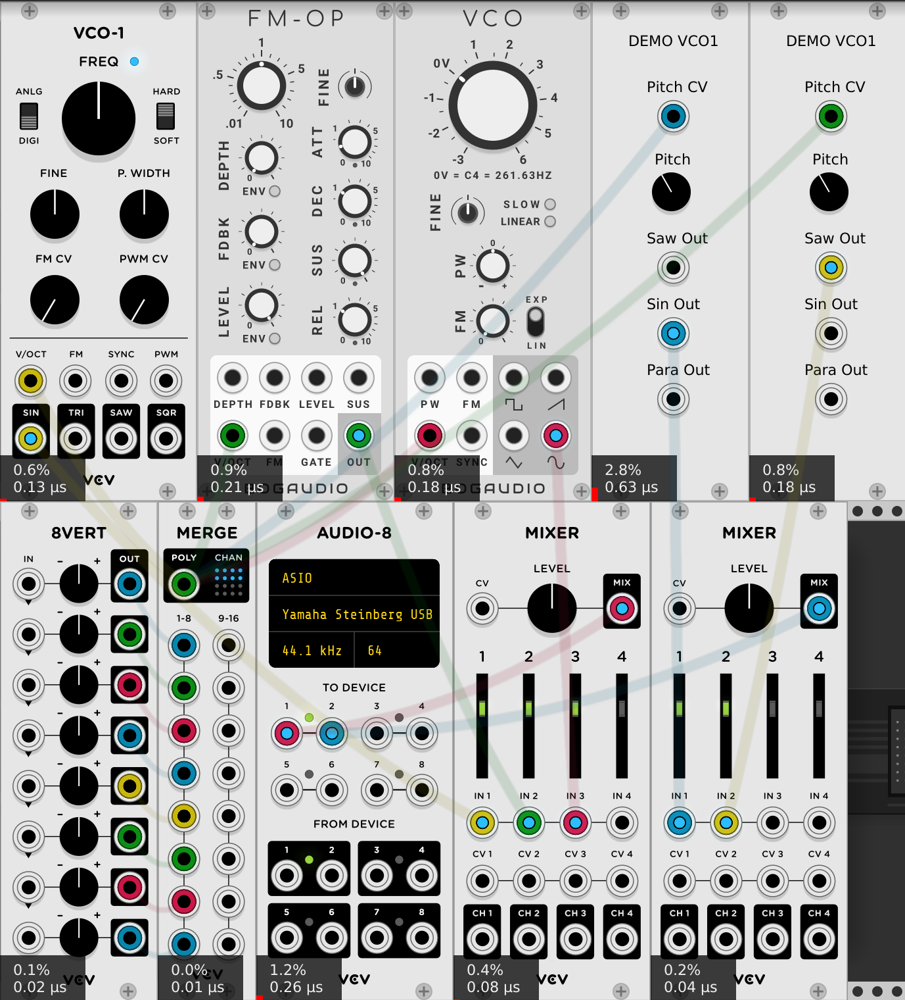

# CPU usage of VCO1

It's always a good thing if a module uses as little CPU as possible. VCV users always want to make bigger and bigger patches, and not all VCV users have the latest, fastest computers. If you make a module that uses "too much" CPU, it may not be as useful as you are hoping.

But how much is "too much" CPU, and how do you measure it?

As to what is an appropriate amount of CPU to use, one easy thing to do is pick a "comparable" VCV module and compare yours to that. Luckily for this project there are plenty of VCO's out there, so it's not too difficult to identify a comparable. If your module is completely unlike any other it may be more difficult.

As far as measuring an easy and obvious way is to use VCV's CPU meters. These aren't really accurate enough to see a small difference like 5%, but they are quite good for a quick comparison of different modules.

So, here is a monophonic patch with several different VCO's: The VCV Fundamental VCO-1, Bogaudio VCO, Bogaudio FM-OP, DEMO VCO1 sin, DEMO VCO1 saw.

First a note about these VCOs. They were chosen because they are very high quality, they don't use a lot of CPU, and they are widely used. Of course they all have many, man more features than the DEMO VCO1. These features can and often do require more CPU to implement. Different plugins take very different approaches to conserving CPU usage, so same may no use CPU for features that aren't in use, others don't use that trick, they just do everything very efficiently. These VCOs are also all open source, do you are free to look inside and see how they work. Also, please read the license first, but these plugins all appear to grant you the right to re-use code from them. This can be very useful!

As you can see, the patch is using the VCV Merge module to generate a known CV input with one channel. This CV goes to all the VCOs. An output from each VCO goes to mixer, and then to the audio card. So it's a realistic patch where everything is doing some work. And, of course, the CPU meters are on.

Looking at these reading, it looks like both Bogaudio VCO's, and Demo Saw use a very low .1%. Demo Sin and VCO-1 both use considerably more. Of course as we mentioned before VCO-1 has many other tricks up its sleeve. From this simple test, things aren't looking so good for our VCO1: it uses as much or more CPU than the others, while offering many fewer options.

 Now let's use the same patch, but this time with 8 polyphonic channels active:

 

 Something interesting has happened here. Now the Fundamental VCO-1 is the best for CPU usage, both Bogaudios and DEMO Saw are pretty good, and DEMO Sin is terrible.

 Why has Fundamental VCO-1 gone from OK as a monophonic VCO, but really good polyphonic? It's because it uses the SIMD instructions of the Intel CPU to generate four voices at once. So, as might be expected, it only take twice as much CPU for VCO-1 to generate 8 voices as to generate 1. The other VCOs are acting as expected. With 8 voices they take much more CPU than 1. 
