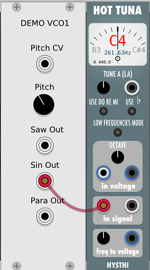

# First test of Demo VCO1

## Examine on scope

Since Demo VCO1 will always generate at least one channel of output, we can look at that output with the VCV Fundamental Scope without needing to make a patch which outputs audio.

Let's look at the different waveforms using Scope:

We can see some good things here. The basic shapes of all the waveforms look correct, with no obvious gaps, jumps, or other strangeness. The output voltage swings between +5V and -5V as desired (except the crazy parabolic - more on that later).

Now let's check out the tuning. First - with no input (zero volts) the VCV spec says we should put out C4. Here we are using NYSTHI's Hot Tuna to check the pitch.

Now, let's see if it tracks at 1V/Octave like it's supposed to. Here we again use Hot Tuna to check the pitch, VCV's MIDI-CV to generate precise voltages, and NYSTHI's multivoltimetro to display the voltage.

So we see that the pitch changes by an octave when the CV changes by a volt.

So far, it looks like Demo VCO1 is working perfectly, but in our next session we will dig a little deeper and find some pretty bad flaws in how it works.

The next page discusses [CPU consumption](./vco1-cpu.md).
