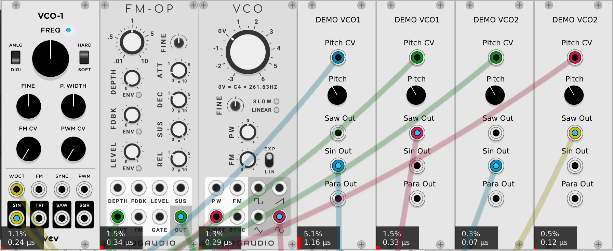

# Introducing Demo VCO2

So far we have seen that Demo VCO1 pretty much works, but has two terrible flaws:

* It uses way too much CPU to generate a sin wave.
* The sawtooth output has way too much aliasing and other "digital nasties".

Along the way we have learned how to measure these things - knowledge that is very useful when evaluating which modules you might want to invest your time in.

There are very command and straight forward ways to fix these things, and VCV provides the tools to make it easy for a module developer.

First the easy one - the CPU usage. There are two immediate "red flags" in the VCO1 source code, and they are both cases where we called the standard C++ functions. In general you are playing with fire calling any standard functions from your time sensitive code.

You may wonder - "why should that be true"? Why, after all, would today's compilers and runtimes provide bad implementations of these functions, and how can we do better? The answer is, the standard implementations are not bad, they are very, very good. But they have different requirements than VCV:

* They are required by the C++ spec (and common sense) to be extremely precise.
* They are required to accept any valid number as an input.
* Probably some other things I'm not thinking of.

With this in mind, it's pretty clear that using std::sin() to shape our sine wave is going to be using up a lot of CPU. If we didn't know that, and merely suspected it, we could just remove that function and run the test again. But here it is obvious, because the only difference between our sawtooth and our sinewave is that one function call.

What are our requirements?

* We will be sending it only numbers between 0 and 1, where 1 represents 2 * pi in radians.
* It needs to be accurate enough that the resulting sine is "pure enough".

In this case we don't have to to agonize over this, or do our own math, because we can just use the code from Fundamental VCO-1.
We can see from the documentation that the function domain is 0..1 like we want, and the sine purity of VCO-1 seems fine.

While we are at it, we can see that where we convert the V/Octave into a linear frequency we use std::pow. Now, two things about this:

* pow is usually not as slow as sin.
* As a "pre optimization" we are already only doing this calculation every 4 samples.

None the less, VCV provides a faster function just for this purpose, so we might as well use it.

Later we will talk about alias reduction, but now let's look at the CPU usage.

This time we increased the patch polyphony to 16, to make the number large enough to read.

The first surprising thing - almost shocking - it that VCO2's sine is almost 15 X more efficient now!

Another surprise is that VCO2 sin is at least three times more efficient that the other VCOs.

Now let's look at the aliasing.

